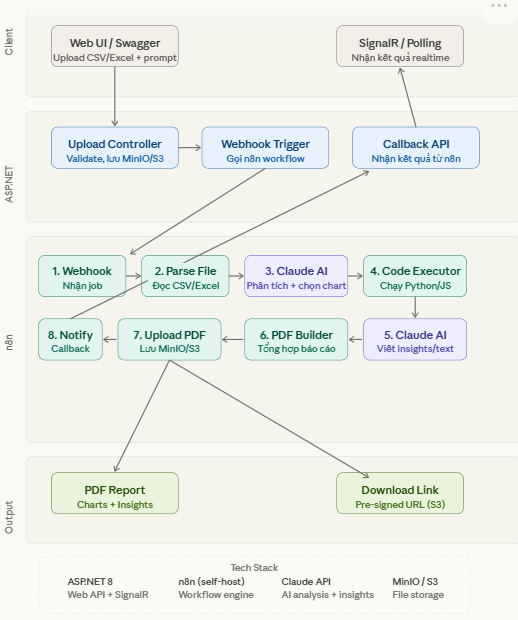

# Tổng quan dự án (Project Overview)

## 1. Mô tả dự án
Tôi đang xây dựng "DataAgent" — một web app cho phép người dùng upload file CSV/Excel,
AI tự động phân tích dữ liệu, chọn biểu đồ phù hợp, sinh code Python để vẽ chart,
viết insights, và tạo báo cáo PDF. Kết quả được push realtime về browser qua SignalR.

## 2. Công nghệ sử dụng (Tech Stack)
Tech stack:
- Backend: ASP.NET 8 Web API, Clean Architecture (API / Application / Infrastructure / Domain)
- Database: SQL Server 2022, Entity Framework Core 8, Code First
- Queue: Hangfire + SQL Server storage
- Realtime: SignalR
- File storage: MinIO (S3-compatible)
- Workflow engine: n8n (self-hosted, gọi qua Webhook)
- AI: Claude API (Anthropic) — chỉ gọi từ n8n, không gọi từ ASP.NET
- Chart renderer: Python FastAPI microservice (pandas + matplotlib + weasyprint)
- Deploy: Docker + Kubernetes
- Email: SMTP qua n8n (gửi PDF báo cáo tự động)

## 3. Cấu trúc thư mục (Project Structure)
DataAgent.sln
src/
  DataAgent.API/                   ← Entry point, Controllers, Middleware
    Controllers/
      AnalysisController.cs
      FileController.cs
    Hubs/
      AnalysisHub.cs               ← SignalR Hub
    Middlewares/
      ExceptionMiddleware.cs
    Program.cs
    appsettings.json
    appsettings.Production.json
  DataAgent.Application/           ← Use Cases, DTOs, Interfaces
    UseCases/
      AnalyzeFile/
        AnalyzeFileCommand.cs
        AnalyzeFileHandler.cs
    DTOs/
    Interfaces/
      IFileStorage.cs
      IJobQueue.cs
      IEmailService.cs
  DataAgent.Infrastructure/        ← Implementations
  Storage/
      MinIOStorageService.cs
    Queue/
      HangfireJobQueue.cs
    Email/
      SmtpEmailService.cs
    Persistence/
      AppDbContext.cs              ← EF Core
      Migrations/
  DataAgent.Domain/                ← Entities, Value Objects
    Entities/
      AnalysisJob.cs
      UploadedFile.cs
tests/
  DataAgent.UnitTests/
  DataAgent.IntegrationTests/
n8n/
  workflows/
    data-analysis-main.json        ← Workflow chính (export từ n8n UI)
    email-report.json              ← Sub-workflow gửi email
  credentials/                     ← Không commit lên git
  .env
chart-service/
  main.py                          ← FastAPI app
  executor.py                      ← exec() sandbox
  requirements.txt
  Dockerfile
infra/
  docker/
    docker-compose.yml             ← Local dev
    docker-compose.prod.yml
  k8s/
    namespace.yaml
    api-deployment.yaml
    n8n-deployment.yaml
    chart-service-deployment.yaml
    sqlserver-statefulset.yaml
    minio-statefulset.yaml
    redis-deployment.yaml
    ingress.yaml
    configmap.yaml
    secrets.yaml                   ← Không commit, dùng Sealed Secrets
  helm/                            ← Helm chart (nếu dùng)
.github/
  workflows/
    ci.yml
    cd.yml

## 4. Các luồng xử lý chính (Main Workflows)

## 5. Các quy tắc/Yêu cầu đặc biệt (Rules & Requirements)
Nguyên tắc code:
- Dùng CQRS + MediatR cho Application layer
- Dùng FluentValidation cho tất cả request validation
- Dùng Serilog cho structured logging
- Secrets đọc từ environment variables, không hardcode
- Tất cả async/await, không dùng .Result hoặc .Wait()
- XML doc comments cho public methods

